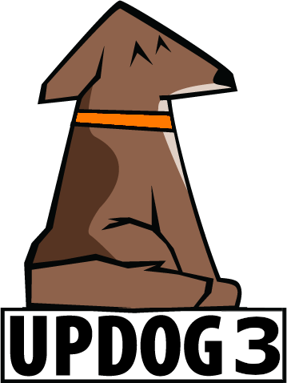

# Context

Hey! welcome to my first post!
Let's right dive into matters:

{: .width=40}
_Updog3 is here!_


In a recent pentest I needed a way to upload and download files to the client's network.

This network was protected in such a way that their proxy only allowed specific ports outbound (443/tcp) and allowed only specific protocols (http[s]). It also dropped any connection to sites using self-signed certificates, therefore a raw python script using Flask and similar would not work.

My colleague [Stu](https://x.com/NoobieDog) suggested to use Sc0tfree's [Updog](https://github.com/sc0tfree/updog), so I decided to give it a go.
The tool has not been updated in 4 years and have quite a few unattended issues still open. It also generated their own self-signed certificates on the fly, which is nice in some scenarios, but not in this one, as the proxy cut the connection due to that.

Some issues of the project requested to [allow custom certificates](https://github.com/sc0tfree/updog/issues/28), [hide the full path to the folder](https://github.com/sc0tfree/updog/issues/36), and decide [whether the server allowed upload or not](https://github.com/sc0tfree/updog/issues/20). Seeing that these issues were open for a while I decided to address them myself.

As a result, I got [Updog3](https://github.com/felmoltor/updog3) (I could not use updog2 as there were already another project called updog2 🤷), a fork of Updog, with that three features implemented. These three new features can be used by means of three new flags during execution:
* `--cert cert.pem key.pem`: This flag sets the certificate to use. It allows you to use custom certificates such as Let's Encrypt ones.
* `--upload [only, enabled, disabled]`: This sets the mode of upload/download. The three options are self-explanatory.
* `--fullpath`: This is a switch. If provided, the full path to the directory with be displayed.

I also did a poor and lousy attempt to update the logo (Sorry to the original logo creator, I am not a designer 🫠) to show Updog3 instead.

And you may ask: _"Why did you do this, Felipe? Isn't there already a bazillion upload tools for this purpose, such as [gosh](https://github.com/patrickhener/goshs)? Aren't you a bit dense?"_

The response would be "yes" to all these questions, but in my defense I would say that by doing this I had the chance of learning a bit more of github workflows, and pypi publishing, which was a first time for me. And what's a better reward in life than learning new things in a process? eh? tell me? maybe a million euros? yes, maybe, but that's not the point. I am rambling.

# Installation

There are three modes to install and use the tool:

* Installing with pip:
```bash
pip install updog3
updog3 -p 443 --ssl --cert /certs/cert1.pem /certs/privkey1.pem -d /transfer
```
* Using docker:
```bash
# If you are not logged in:
docker login ghcr.io -u <youruser>
# Pull latest
docker pull ghcr.io/felmoltor/updog3:latest
# Tag it as updog3:
docker tag ghcr.io/felmoltor/updog3:latest updog3
# Run from docker mapping port 443 and your domain's certificates
docker run -p 443:443 -v $(pwd)/transfer:/transfer -v /etc/letsencrypt/archive/yourdomain.com/:/certs/  updog3 -p 443 --ssl --cert /certs/cert1.pem /certs/privkey1.pem -d /transfer
```
* Installing with pipenv from source:
```bash
git clone https://github.com/felmoltor/updog3
cd updog3
pipenv install .
pipenv shell
which updog3 # to verify you are using the module installed with pipenv
updog3 -h
updog3 -p 443 --ssl --cert /certs/cert1.pem /certs/privkey1.pem -d /transfer
```

# Future Work
There are a few open issues in the original repository that I intend to address, for example:
* [Zip and download dirs](https://github.com/sc0tfree/updog/issues/40)  [✅ Done]
* [Change interface](https://github.com/sc0tfree/updog/issues/44). [✅ Done]
* [Add webdav](https://github.com/sc0tfree/updog/issues/25)

And that's all!
If you use the tool and have any suggestion to improve it, ping me.

# Links:

* [https://pypi.org/project/updog3/](https://pypi.org/project/updog3/)
* [https://github.com/felmoltor/updog3](https://github.com/felmoltor/updog3)

