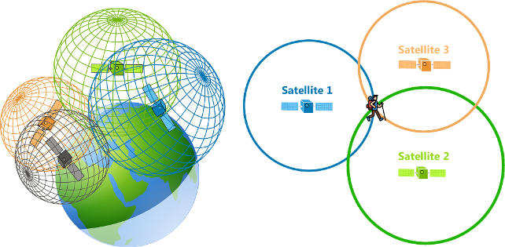
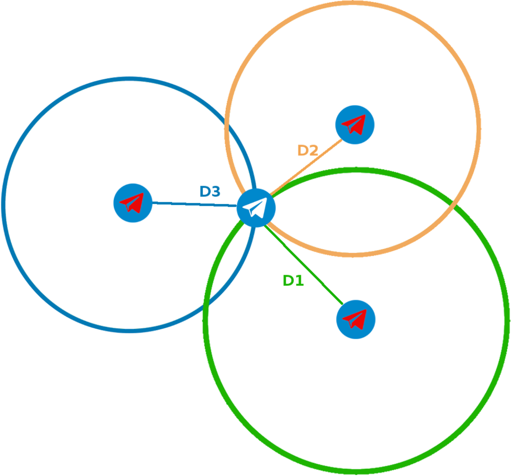
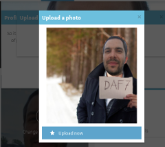
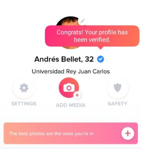
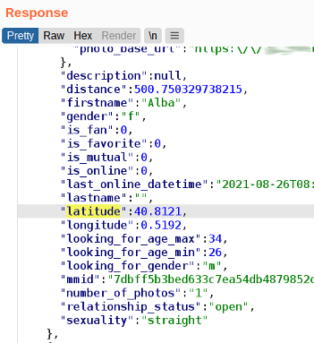
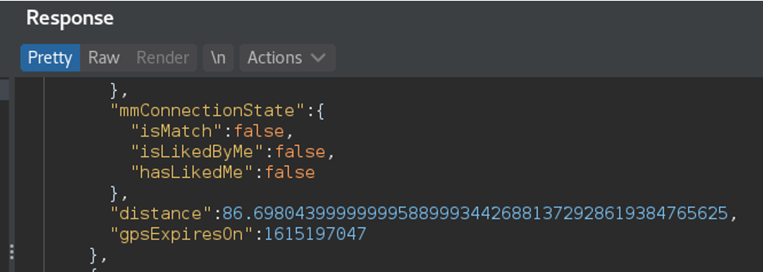
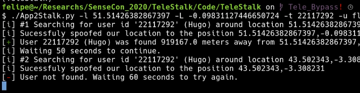

## Context ##

This is an "old" research, but I just wanted to inaugurate the blog with an article on something we put a lot of effort in 2021 and never got to be published anywhere. Seeing that recently this topic got attention during last [Black Hat USA 2024](https://i.blackhat.com/BH-US-24/Presentations/US24-Dhondt-Swipe-Left-for-Identity-Theft-Thursday.pdf) and [some media](https://www.404media.co/this-tool-shows-some-telegram-users-approximate-physical-location/) it's a bigger encouragement to publish this.

(Disclaimer: This post presents a topic studied in 2021. The current state of the applications shown here has not been reassessed in 2024 and it is possible that many of the findings are not such anymore)

In [SenseCon 2020](https://sensepost.com/blog/sensecon/), my colleagues [Emmanuel Cristofaro](https://x.com/stutm), [Bart](https://x.com/crypt0rr_) and I took a look to the Telegram API. Two interesting observations came out from that work:
* It was possible to disclose "Anonymous Admins" of groups (I hope to do do a separate post about it in the future) 
* The feature "People Nearby" just released that year sounded like the previous Tinder and Grinder geo-location fiascos.

We decided to keep investigating the second topic. As a result, we presented in BSides Copenhagen 2021 the talk ["Breaking the security of Location Enabled Apps"](https://vimeo.com/621385238), that I wanted to summarise here. 

# Telegram

The people nearby feature looked like this: 



This feature told you with great accuracy (nowadays Telegram does not provide this accuracy anymore) how far were the people from you. I started smelling something here (and it was not me). Let me present you my friend:


_Trilateration!_

As per the Wikipedia:

> Trilateration is the use of distances (or "ranges") for determining the unknown position coordinates of a point of interest, often around Earth (geopositioning) - [Wikipedia](https://en.m.wikipedia.org/wiki/Trilateration)

Trilateration is a very old technique, and its used for many legitimate purposes. For example, satellites use it to know your exact location on the earth:


_Trilateration is used by GPS systems to locate you during your trip to Sierra Nevada mountains_

If we apply this techinque to Telegram or any other application providing you distances to targets with great accuracy, we could mimic the technique. By faking our GPS location three times you could obtain three different distance measures to your target. This meant that you could use trilateration techniques to pinpoint you target in the map:

{: width="400" }
_Applying trilateration to Telegram_

I started manually spoofing the location of my testing device, taking note of the distances to the targets in a spreadsheet and drawing circles in Google Earth. This was boring and slow as hell, so went down the automation road and as result got multiple tools (refer to [the code](#the-code)). 

(Note: Initially, this tool was not released due to the concerns against the privacy of the users of Telegram. But after certain point, many people released their own tools and post, so that is not a concern anymore.)

The tool, was initially only targeting Telegram, but soon I grew hungry and decided to extend the study to other Apps, specifically to dating apps. Dating apps are prone to this breach of privacy because it's assumed and accepted by the users of the application to give away their private information to have better chances to find a partner. It's assumed, and it's part of the game.

# The target apps

I wanted the study to be as broad as possible, covering as many dating apps as possible. In the end we analyised 28 dating apps.
The list of targeted apps was the following:

1. Adopta un tio
2. Tinder
3. Happn
4. POF
5. Lovoo
6. iDates
7. Hinge
8. Jaumo
9. Local Dating/Hook Up
10. eharmony
11. Ashley Madison
12. Taimi
13. Grindr
14. Badoo
15. Date My Age
16. Zoosk
17. Meetic/Match/Ourtime
18. Bumble
19. Skout
20. Amoresporadico
21. Tagged
22. DateMe
23. OkCupid
24. Romeo
25. Recon
26. Growlr
27. Hornet
28. Manhunt

(You should have seen my testing phone with all those apps installed at the same time, my wife thought I had a problem, but that's another topic not to be discused here).

# The Essential Security Tests 

Firsts and foremost, the main objective of the study was to see if we could accurately geo-locate targets in an automated manner. Then, other basic smoke tests were carried against the mobile applications. The summary of the test was the following:

1. Vulnerable to precise geo-location of users
2. Vulnerable to rough geo-location
3. Easy to spoof your own geo-location (e.g. providing a parameter in a POST request)
4. [Certificate pinning](https://www.ssl.com/blogs/what-is-certificate-pinning/)
5. [Root/Jailbreak detection](https://mas.owasp.org/MASTG/tests/ios/MASVS-RESILIENCE/MASTG-TEST-0088/)
6. [Profile verification mechanisms](https://www.help.tinder.com/hc/en-us/articles/4422771431309-How-Does-Photo-Verification-Work#h_01H05ZJJT6JR30HX4HCFBBS4HG)

We got the following results: 

* 100% of the analysed applications did not have any mechanism to refuse to run on root/jailbroken devices.
* 94% of them did not have certificate pinning.
* 88% did not have profile verification.
* 7 apps could have their users geo-located. 
* Three Proof of Concepts (PoC) for these 7 applications were created (see [The Code](#the-code)).

It is important to mention that Tinder and Grinder, the most famous and notable dating apps at that moment, already went through this kind of analysis by someone else and, after their respective public drama, implemented security mechanisms such as grid snapping. 

# Additional Tests - Liveness Check Bypass

Having observed that some applications presented the possibility to accurately get-locate users by trilateration attacks, we wanted to verify how easy was to create fake accounts to carry out this attack.

Some applications, not all, requested you to verify your profile pictures before being able to interact with their services. Basicaly, we could observe three levels of "profile verification", which we tried to bypass using three different approaches:

1. **Fake photo**: Just providing a fake photo to create a new profile. No verifications done. You could have as many profiles as you wanted as long as you could provide an email and a photo. I used the service [https://thispersondoesnotexists.com](https://thispersondoesnotexist.com/) to provide the photos and that was ok for many of the target apps.
2. **Static photo verification**: Some applications asked you to provide a photo and striking a pose or showing some verification message. The "bypass" was just to do a dumb edit with the profile photo pasted onto another photo of me striking the pose. Not even the colours of the skin needed to match. Amazingly, this worked for **some** of the applications (while having some good laughs doing the edits).


_Some applications verified you by asking you to provide a paper with specific message_

_Other applications asked you to strike a pose_

3. **Liveness video verification**: Some applications requested you to send them a video of you moving your head in a certain way or striking a pose. In 2021, the deepfake technology was all in the rise, so we decided to jump into the hype vagon and see if it was possible to enroll in applications bypassing the likeness checks. **Spoiler**: it was:

{: align='center'}
_This is another non-existsent guy_


_A dating app asking to pose for them_

_Dating app verified the fake profile_

We found that it was possible to early create fake accounts to proceed with the automated geo-location in some applications. 
These observations go in line with the findings of [NIST FATE PAD evaluation from 2023](https://nvlpubs.nist.gov/nistpubs/ir/2023/NIST.IR.8491.pdf), where they said in [this publication](https://www.nist.gov/news-events/news/2023/09/whats-wrong-picture-nist-face-analysis-program-helps-find-answers):
> Only a small percentage of developers could realistically claim to detect certain presentation attacks using software. Some developers’ algorithms could catch two or three types, but none caught them all. — Mei Ngan, NIST computer scientist

Well, here's is that. If we could reproduce the findings of NIST using a virtual camera for our device, [ffmpeg](https://www.ffmpeg.org/) and [Reface](https://play.google.com/store/apps/details?id=video.reface.app&hl=en&pli=1), anyone can.

## The Code ##
As a result of this study, I have recently uploaded the PoC code to geo-locate users of three applications, two dating apps and Telegram. One of the dating apps is no longer active, but it was pretty used in Spain ([around 3 million uses as some point](https://www.reasonwhy.es/actualidad/adopta-un-tio-rebranding-adopte-slow-dating)): adoptauntio (adopt a man). I will not name the third application, as it's target population was different sexualities, a population specially susceptible if a privacy breach happens. 

The code is in github and it has been defanged, so you need to invest some time investigating to make it work:

[https://github.com/felmoltor/telestalker](https://github.com/felmoltor/telestalker)

## The Demos ##

For each of these three applications I recorded a video showing how easy was to obtain the precise location of the target: 

## Telegram
This first video shows how an area is swept to gather all users that appears three or more times within that range. The resulting map shows the location of all these users in the map. The command executed is similar to the following:

```bash
./App1Scan.py
  --start-coords 51.47,-0.17 
  --stop-coords 51.45,-0.106 
  -d data/scans/database.csv
  -o data/scans/out.csv 
  -k output/map.kml
```


## Adoptauntio
This second video demonstrates how it is possible to locate a specific user within an area. The target application is different than Telegram, specifically the now defunct application 'Adoptauntio'. As a result of the execution the script will display the geolocation of the user.
The command here is similar to this:

```bash
./App2Scan.py
  -c "Jaen, Jaen, Andalucia, Spain" 
  -t "<targetuser ID>"
  -u user@gmail.com
  -p password
  -k output/map.kml
```




## Third App

This demo is similar to the first Telegram video, but the target application is different. During this demo we sweep an area for users of the application. The command executed is similar to the Telegram one, but we have also to specify the username and password of our account:
```bash
./App4Scan.py
  --start-coords 51.47,-0.17 
  --stop-coords 51.45,-0.106 
  -u user@gmail.com
  -p password
  -d data/scans/database.csv
  -o data/scans/out.csv 
  -k output/map.kml
```



## Conclusions and Recommendations ##

When I started the research, I thought that I was not going to be successful, as many dating apps should already have learn their lesson from Tinder and Grinder problems from the early 2010's, but I saw that was not the case I was shocked to see that, still, some less-known apps even directly provided the latitude and longitude of the target for the client application to do the distance calculation. 
Many other applications did not provide that information directly, but the possibility to trilaterate the target acurately was still there. 
Other applications rounded up the distance in chunks of 200 or 500 meters or adding random noise to the distances so you wouldn't get the exact possition of your target, but rather a rough estimate. There are smart ways to bypass that 'rounding' protection, such as the one described in [this nice post about Tinder protections](https://robertheaton.com/2018/07/09/how-tinder-keeps-your-location-a-bit-private/) by Robert Heaton.
Another protection that I found was the grid-snap technique described again in Robert Heaton post, whereby an application divides the map in a grid and generalises the position of all the users within that cell of the grid to the center point of the cell. 
These last two mechanisms prevent the acurate location of a target, but still, you can obtain an idea of the neighbourh your target lives in (unless other countermeasures are in place in the app).

# Recommendations and Mitigations
## Treat location information as sensitive 
The most basic and common sense recommendation that I can give is not to send out the location of your users via your API. 
This recommendation might seems dumb, but, trust me, I've seen this being done: Apps calculating the distance between two users on the client-side. For that, the application received the coordinates of each other user, THIS IS DUMB:


_Latitude and longitude of users provided directly by an app API_

A bonus recommendation not directly related to the geo-location concern would be not to give all information of the users via the API, even if it is not displayed in the App UI. For example, providing the "sexuality" information via the API is not needed by the UI, but it is sent nevertheless by the API. This is also dumb.

## Don't be accurate
Look to this picture and tell me you need 46 decimal digits to tell your users how far away are they from you. Do they really need to know what's the closest electron of the target person body? What's the value in that?


_How far is the closest electron of this user to me?_

## How far would you go?
Why your API would need to provide results for people that is thousans of kilometers away? (for the US readers: a Kilometer is like a Mile but with less eagles and freedom). Providing results of people so far away only makes any geo-location scanner much more potent, reducing the number of calls the attacker needs to place to your API, hence, reducing also your capability to detect them:


_There's no one in your area, buddy, but here you have a user from Vladivostok_

## Provided outdated data
This may be crazy, but, what if you don't need to provide the current location of the user at all times? Maybe polling the user 4 times per day is enough for you to provide location data of the user. This way you don't need to provide your users with a real time tracker of their devices. It is creepy to have an app uploading your current location constantly to a server to be broadcasted to all other users.
Consider what's the advantage of constantly retrieving your user current location. If there is no advantage or business use case (like you being a provider of tracking devices), then just poll for that information a minimum amount of times per day.

## Mitigations against trilateration
## Do not trust user input
Assume your users can be malicious, just don't trust the data provided by the client side, more so if we are speaking about your API receiving the coordinates of your user as some kind of parameter. 
I know it is difficult to control whether the user is spoofing their geo-location on the device itself, but please, don't make it easier for attacker by just ingesting their coordinates from an API endpoint.

## Enforce API rate-limits
Monitor your application for users requesting frequent information from the endpoint that provides the distance of to targets. A high number of request on that endpoint should be an indicator of someone doing nasty things on your app. Either throttle the responses, provide bogus data on the Nth attempt or block the offending accounts right away until further explanations are provided by the user.

### Monitor 'impossible travels'
In combination with monitoring the number of calls made to API endpoints providing the distances of your users, also monitor what is called ['impossible travels'](https://www.pingidentity.com/en/resources/cybersecurity-fundamentals/detect-risk/impossible-travel-101.html). 
The most frequent technique use to obtain the location of the people was trilateration. To scan broad areas of the map for user using trilateration requires the attacker to, either walk or drive between distant points while taking measures of distance to your targets (similar to wardriving), or to simply spoof your location and lie to the app. If you, as the app owner detects users doing the [Sanic](https://static.wikia.nocookie.net/sonic-the-hedgehog-conspiracies/images/e/e6/Sanic.jpg/revision/latest?cb=20201217013823) accross the city, that's a pretty clear indication of someone messing with you.

## Enforce Profile Validation
The less fake accounts your platform allows to create, the less potential attackers you will have geo-locating your users.
One way to prevent proliferation of fake accounts in your application is to enfoce profile validation with a proper liveness checking backed up by humans reviewing all the doubful videos. 
Have in mind that image identification and process tasks should be considered as a supporting mechanism for humans, not the other way around.

## Implement hardening on Apps
Implement security in your apps. It may be considered basic stuff, but I could not analyse the security of some applications because theys were implementing good certificate pinning mechanism, code obfuscation, emulator detection, and similar counter measures against reverse engineering. 
As my objective was going for the low-hanging fruit, those essentinal measures deterred my investigations and so they will deter the investigation of real attackers.

## More resources ##
Other interesting links about this topic:
* Swipe Left for Identity Theft - https://lepoch.at/files/dating-apps-usesec24.pdf
* https://research.checkpoint.com/2024/the-illusion-of-privacy-geolocation-risks-in-modern-dating-apps/
* https://robertheaton.com/2018/07/09/how-tinder-keeps-your-location-a-bit-private/ 

