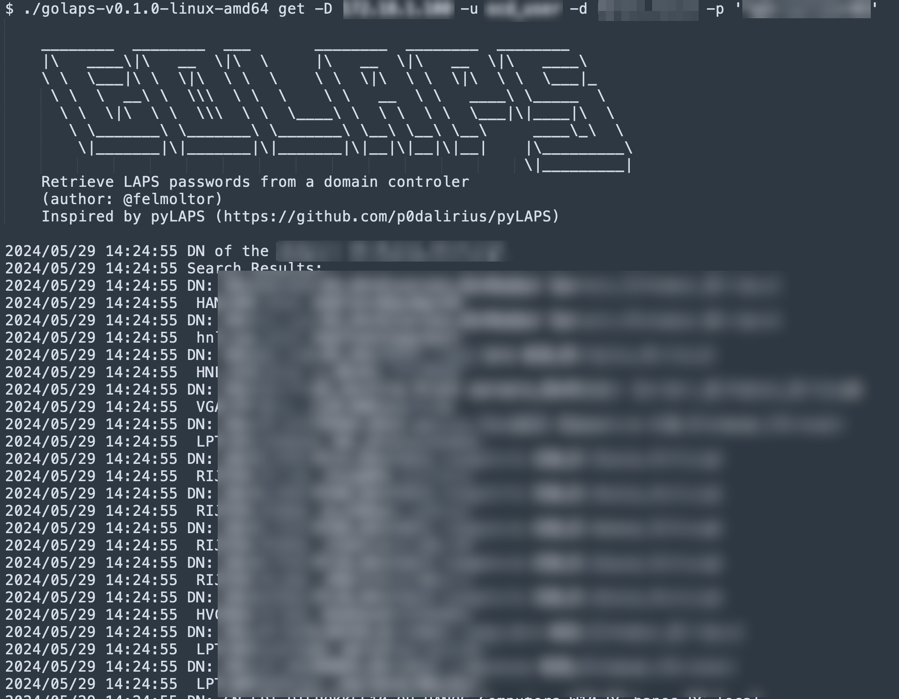

# Original Post
This is a mirror of the original post in [Orange Cyberdefense](https://www.orangecyberdefense.com/)/[SensePost](https://sensepost.com/) blog [here](https://sensepost.com/blog/2025/golaps/). 

# Context
During the last SenseCon we had at OrangeCyberdefense in May 2024 (see https://sensepost.com/blog/sensecon/), we usually either pick-up from a list of ideas or pitch our own to implement in the 24 hours to work on whatever project is itching you.

I proposed a few ideas. I’ll leave some of them here verbatim (I have removed the ideas that were only applicable internally), in case you want to tackle the challenges yourself or they inspire you to do something else:

* Applied research of IaC: I want to learn Terraform. We will apply it by deploying a basic red team infrastructure with evilginx, mail-in-the-middle and Cloudflare workers.
* CI/CD pipeline to automate obfuscation of Sliver implants: How to implement an encryption layer into a Dliver/Cobalt Strike binary automatically with CI/CD pipelines.
* Vishing with AI: We’ve heard GPT4o speak, and AI bots speaking with scammers. I want to do a PoC of an AI voice bot that can do vishing for our RT engagements.
* goLAPS: An excuse to learn Golang and create a cool tool. I found pyLAPS (https://github.com/p0dalirius/pyLAPS) but wanted to have a Windows native executable with the same functionality written in Golang, just because I want to learn it. However, there is a strong restriction, DON’T USE ChatGPT.

I ended up doing the last one: goLAPS, as an excuse to learn Golang. My colleagues Deon and François Reynaud joined.

Deon also wanted to learn Golang and applied his infrastructure knowledge to deploy the Domain Controller to test the tool against. He used the Cloud Development Kit for Terraform ([CDKTF](https://developer.hashicorp.com/terraform/cdktf)) for this.

I dealt with the tool code itself while François helped with the argument parsing functionality. The result of this effort was goLAPS, which can be found in: [https://github.com/sensepost/goLAPS/](https://github.com/sensepost/goLAPS/)

For the first time I also decided to try out github workflows to automatically generate the binaries every time I pushed to the main branch.

Anyway, here’s how to use it.

# Usage
It can read the LAPS passwords from a domain controller with the 'get' command. You can optionally provide a file to save the output to a CSV file with the -o/–out flag:

```
./golaps get -h

[...]           

usage: golaps get [-h|--help] -D|--dc "<value>" -u|--username "<value>"
              -p|--password "<value>" -d|--domain "<value>" [-f|--filter
              "<value>"] [-o|--out "<value>"]

Arguments:

  -h  --help      Print help information
  -D  --dc        <IP|FQDN> of the Domain Controller to query.
  -u  --username  Username to authenticate with.
  -p  --password  Password to authenticate with.
  -d  --domain    Domain of the user authenticating.
  -f  --filter    Substring of the computer name (samAccountName) to search
                  for.
  -o  --out       File name of the csv file to write the results.
```

To 'set' a password:

```
./golaps set -h
usage: golaps set [-h|--help] [-D|--dc "<value>"] [-u|--username "<value>"]
              [-p|--password "<value>"] [-d|--domain "<value>"] [-t|--target
              "<value>"] [-P|--lapspass "<value>"]
Arguments:

  -h  --help      Print help information
  -D  --dc        <IP|FQDN> of the Domain Controller to target.
  -u  --username  Username to authenticate with.
  -p  --password  Password to authenticate with.
  -d  --domain    Domain of the user authenticating.
  -t  --target    FQDN of the computer to set the LAPS password.
  -P  --lapspass  Password to set.
```

The tool is already battle proven, as multiple people (including me) have used it in some of our assessments successfully. I mean, look at this beautiful blurry output (well, the point is, it works on real environments):



The tool currently does not support authenticating with hashes, which is sad, but I intend to add that functionality when possible.

[Let me know](https://bsky.app/profile/felmoltor.me) if you find it useful or want to give me any feedback about it.

Happy password hunting!
