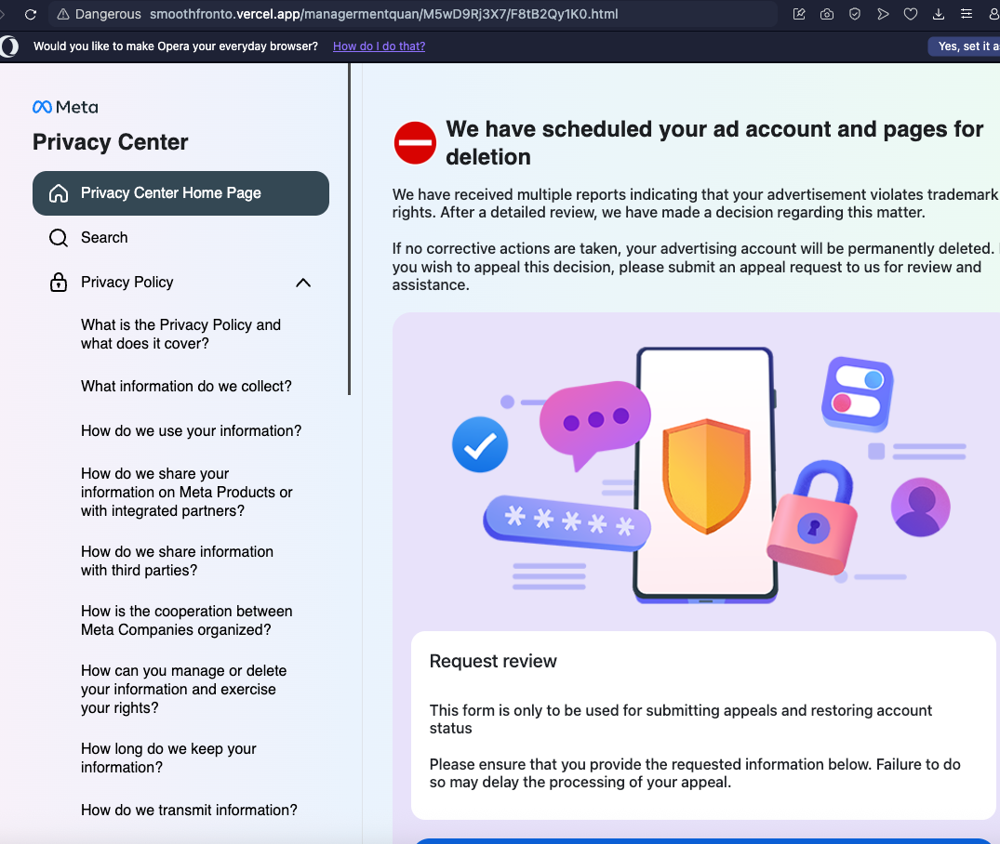
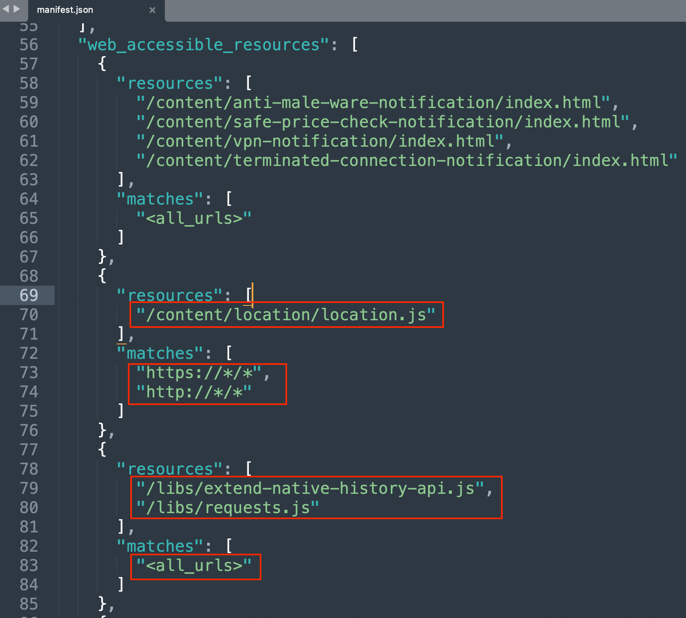
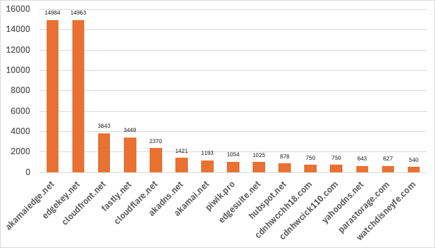

# Context

During one of our weekly internal talks in [SensePost](https://sensepost.com/), I shared a tool that I recently created to detect orphan scripts on websites: [JsJack](https://github.com/felmoltor/jsjack).

When I refer to "orphan scripts" I am referring to script hosted in third-party domains, which are currently expired, thus presenting a chance for you to register that domain and host the "orphan" script. This may lead multiple kinds of compromise vectors of the website hosting that script.

# How it Works
The tool receives a file with a list of URLs you want to analyse. It will craw these websites using [Scrapy](https://www.scrapy.org/) and analyse each crawled page to search for the following DOM elements:

```html
<script src="third party domain">
<frame src="third party domain">
<iframe src="third party domain">
<image src="third party domain">
<link src="third party domain">
<svg><a href="third party domain">
```

For each one of these elements it will pull the `src` or `href` attribute of these nodes and check whether these are pointing to a third party domain. Thereafter, JsJack will do the following checks on the domain hosting the script: 

1. DNS query. If the DNS return NXDOMAIN. Go to step 2.
2. Whois with RDAP protocol. If the domain is not found (RDAP returns a 404 response), go to step 3.
3. Whois. If the domain is not found, we found an orphan script.


By default, the crawler has been restricted to only visit a total of 25 pages of the target website and limit the depth of crawling to 2. It also restricts the number of threads per domain and IP address to 5. All this with the objective of preventing any denial of service or impacting the service.

You can tweak these [settings](https://github.com/felmoltor/jsjack/blob/main/subdomain_takeover/settings.py) in the tool or via the CLI arguments (–max-depth, –max-pages, –max-items), but, please, **be gentle and do not impact negatively any website with the crawling**.

# Usage
The tool can be used by installing with pipenv or docker. Refer to the [README](https://github.com/felmoltor/jsjack?tab=readme-ov-file#docker) of the project for further details.

You can build the docker image by cloning the project and docker build:

```bash
git clone https://github.com/felmoltor/jsjack
docker build -t jsjack:latest .
```

Alternatively you can pull it from the GitHub docker registry (authentication git a [PAT](https://docs.github.com/en/authentication/keeping-your-account-and-data-secure/managing-your-personal-access-tokens) is required):

```bash
docker pull ghcr.io/felmoltor/jsjack/jsjack:latest 
docker image tag ghcr.io/felmoltor/jsjack/jsjack:latest jsjack
```

Finally, if you want to run the tool, map your input and output folders (-v) and provide a Discord webhook (--discord-webhook) where you want to receive your notifications:

```bash
docker run -v $PWD/input/:/app/input/ -v $PWD/output/:/app/output/ -it --rm  jsjack -u input/targets.txt --discord-webhook 'https://discord.com/api/webhooks/<id> --scrapeops-key <key>
```

There are some other flags to customise the tool that I hope are self explanatory:

```bash
usage: jsjack.py [-h] -u URLS [-d DNS] [-A] [-S SCRAPEOPS_KEY] [-D DISCORD_WEBHOOK] [-L {DEBUG,INFO,WARN,ERROR,CRITICAL}] [-E MAX_DEPTH] [-I MAX_ITEMS] [-P MAX_PAGES]

Run Scrapy takeover spider with options.

options:
  -h, --help            show this help message and exit
  -u URLS, --urls URLS
  -d DNS, --dns DNS
  -A, --allow-fld
  -S SCRAPEOPS_KEY, --scrapeops-key SCRAPEOPS_KEY
  -D DISCORD_WEBHOOK, --discord-webhook DISCORD_WEBHOOK
  -L {DEBUG,INFO,WARN,ERROR,CRITICAL}, --logging-level {DEBUG,INFO,WARN,ERROR,CRITICAL}
                        Set the logging level (default: DEBUG)
  -E MAX_DEPTH, --max-depth MAX_DEPTH
  -I MAX_ITEMS, --max-items MAX_ITEMS
  -P MAX_PAGES, --max-pages MAX_PAGES
```

# Results
I'm not going to lie, I am a bit sad that the results I had running the tool against bug bounty and phishing URLs are much more modest than I was expecting.

Given the relatively large amount of URLs that I provided to JsJack to crawl, the results I got were a bit meager:


Nevertheless, I had interesting stuff to comment and, the results, although did not lead to direct compromises, were enought to spark conversations and new ideas on how to improve the tool in the future.

As an example, I can highlight two interesting cases that JsJack helped me to discover:

# Interesting Cases
## Case #1 - cdn.polyfill.io 
During the early stages of the tool, I received multiple notifications of bug-bounty-related domains that orphan scripts were hosted in cdn.polyfill.io:


At the same time I was celebrating a voice inside my head was saying “why this domain name rings a bell?”.

When I went to manually check the DNS entries for polyfill.io I found the response was NXDOMAIN. Same result when I queried RDAP.


The only problem arrived when I checked with our old friend whois, showing the domain was registered. Same situation when I went to namecheap to query the domain to purchase:


Now I understood why this domain rang a bell in my head. This domain was hijacked already in 2024 by a chinese company called Funnull and was used in a extensive suply chain attack, which redirected visitors to legitimate pages to gambling and scam sites.

A lot of stories were written about it. Here just a few from Qualys, Cloudflare and others:

* [https://blog.qualys.com/vulnerabilities-threat-research/2024/06/28/polyfill-io-supply-chain-attack](https://blog.qualys.com/vulnerabilities-threat-research/2024/06/28/polyfill-io-supply-chain-attack)
* [https://www.theregister.com/2024/06/25/polyfillio_china_crisis/](https://www.theregister.com/2024/06/25/polyfillio_china_crisis/)
* [https://blog.cloudflare.com/polyfill-io-now-available-on-cdnjs-reduce-your-supply-chain-risk/](https://blog.cloudflare.com/polyfill-io-now-available-on-cdnjs-reduce-your-supply-chain-risk/)

This is when I noticed that, to prevent further false positives, I should update my code to also check for the whois data of the domains, as I was initially only querying for the DNS entry and the RDAP data:


## Case #2 - The Phishing Extension Connection
I decided to scan phishing pages and, after a while, received the following message:


The alert indicated the phishing pages had an script directly injected from a chrome-extension instead of a remote domain. That was interesting.

Upon further exploration of my sources, three aditional pages mimiked the same Meta page:

* https://smoothfronto.vercel.app/managermentquan/M5wD9Rj3X7/F8tB2Qy1K0.html
* https://emulationsq.vercel.app/managermentquan/M5wD9Rj3X7/F8tB2Qy1K0.html
* https://laidoiquaw.vercel.app/managermentloc/abcfghijklmnoqrstuv/zxcvbnmopqrstuvwxyz.html

When visiting these sites, the following screen mimiking Meta’s Privacy Center menu would pop up with the message “We have scheduled your ad account and pages for deletion”. This campaign is part of a broader campaign targiting [Meta Business Users](https://cdn.prod.website-files.com/66fbdb04ee8bb0436308fc15/682438d1a90fb699985a28ae_Meta%20Mirage%20Report%202025%20-%20CTM360.pdf).



The page would later request personal detail and passwords to the users. The interesting part was that three scripts (location.js, extend-native-history-api.js, requests.js) were being directly pulled from the extension with ID [eppiocemhmnlbhjplcgkofciiegomcon](https://chromewebstore.google.com/detail/urban-vpn-proxy/eppiocemhmnlbhjplcgkofciiegomcon?hl=en):


This is not a usual way to integrate scripts into a web page and the purpose of this is not yet clear to me, but it may be possible that they are piggibacking into the extension permissions to break free of the restrictions imposed to the scripts executed in the phishing page (thank you for the hypothesis Leon and Reino). That way, the impact of the phishing would be able expand to other pages the user has currently opened in the browser.

The extension they are (ab)using here is "[Urban VPN Proxy](https://chromewebstore.google.com/detail/urban-vpn-proxy/eppiocemhmnlbhjplcgkofciiegomcon?hl=en)", which has a lot of [bad reputation](https://geekflare.com/vpn/urban-vpn-review/) (collecting logs, selling data, false claims, privacy issues, etc.). Funilly enough, their score in the Android Market seemed to have been pumped by bots, but that's just a feeling:


When installed, it required a significant amount of privileges, such as "Read and change all your data on all websites" which may raise more than one eyebrow:


Interestingly, the Urban VPN Extension explicitly allows the same scripts the phishing pages were loading to be accessed by all web pages in their manifest.json via the directive "[web_accessible_resources](https://developer.chrome.com/docs/extensions/reference/manifest/web-accessible-resources)":



The extension had all its code obfuscated and I did not spend too much time trying to deobfuscate it, or doing dynamic analysis of what it does when you access these phishing sites. Therefore, I cannot give an acurate assesment about the real purpose of the relation between the phishing page and the extension, but I am always open for a good conspiracy theory, shoot it my way if you have one.


Due to this only being a theory, I wanted to verify if the following scenario was possible:

* You visit a phishing site
* The site uses the extension's capabilities to inject code in other tabs related with your business (e.g. keylogger)
* You get your business data and passwords from other tabs sent to the bad guy.

For that I made a dummy proof of concept extension that checks tha a specific `<div>` is present in the source page and modifies a target page DOM.

The code of the dummy extension poc can be found [here](https://gist.github.com/felmoltor/4cb066d1a6fa55ed0d7ae599c7acd88b).


**Disclaimer**: This is just an hypothesis on why a phishing page would embed directly a JavaScript file from an extension. Given the really bad reputation and some suspicious indicators of the Urban VPN extension used in the phishing page some suspicious people may say that both parts are involved in a scheme. But I'm not saying that! I'm just higligthing the interesting relation between a phishing page and how it abuses a bad reputation chrome extension for unknown purposes.

# Statistics

Just out of curiosity, I wanted to see the most frequent third-party domains being used to hosts scripts. Here are the first 15 most frequent domains:



You can see most of them are related to Akamay, Azure, Cloudflare, Fastly, etc. Some others domains were a bit more exotic, such as watchdisneyfe.com.

So, you compromise any of these major domains hosting scripts, and you own the internet (see the polyfill.io debacle).

# Comparison with Dresscode
Comparing the number of orphan scripts that I have found with this JsJack with the number I found with Dresscode, the results clearly favoured [Dresscode](https://github.com/sensepost/dresscode), indicating that it's more frequent to find forgotten domains in the CSP headers of the sites than within `<script>`, `<frame>` and `<iframe>` elements.

# Conclussions
It was more difficult than I have expected to find orphan scripts. I thougth this was going to be a rain of bugs to exploit, but it was not. But I do not take this as a failure, I did something, I failed and learnt multiple things in the way.

[Ping me](https://bsky.app/profile/felmoltor.me) if you find something with JsJack, I would love to know that you received a nice bug bounty thanks to it!